  

  
  
  
  
  

# Day 00: Introduction & Course Goals

## Learning Objectives
By the end of Day 0, you will:
- Understand the course structure and goals
- Set up a Linux environment for hands-on practice
- Join relevant communities for ongoing support
- Define your personal learning goals

**Estimated Time:** 1-2 hours

## Notes
- **Welcome!**
  - This course is designed for aspiring DevOps, SRE, System, and Cloud Engineers who want to master Linux from the ground up.
  - No prior Linux experience required, but basic computer literacy is helpful.

- **What is Linux?**
  - Linux is a free, open-source operating system kernel originally created by Linus Torvalds in 1991.
  - It forms the core of many popular operating systems (called “distributions”), such as Ubuntu, CentOS, and Fedora.
  - Linux is known for its stability, security, and flexibility, which makes it the backbone of most servers and cloud infrastructure worldwide.
  - It powers everything from web servers and cloud platforms to mobile devices and supercomputers.

- **Why Learn Linux?**
  - Linux powers most servers, cloud platforms, and DevOps tools worldwide.
  - Essential for automation, scripting, troubleshooting, and system administration.
  - In-demand skill for top tech jobs (DevOps, SRE, Cloud, System Engineer, etc.).

- **What Will You Learn?**
  - Linux fundamentals, commands, and file system
  - Virtualization, networking, security, and automation
  - Real-world scenarios, troubleshooting, and a mega project

```mermaid
flowchart TD
    A[Linux Learning Journey]
    A --> B[Fundamentals]
    B --> B1[Commands & File System]
    B --> B2[Users & Permissions]
    B --> B3[Process Management]

    A --> C[System Administration]
    C --> C1[Networking]
    C --> C2[Security]
    C --> C3[Service Management]

    A --> D[Advanced Topics]
    D --> D1[Performance Tuning]
    D --> D2[Containers]
    D --> D3[Troubleshooting]

    A --> E[Real-World Projects]
    E --> E1[DevOps Scenarios]
    E --> E2[Mega Project]
    
    %% Styles
    style A fill:#ff9966,stroke:#333,stroke-width:2px,color:#fff,rx:15,ry:15
    style B fill:#66b3ff,stroke:#333,stroke-width:1px,color:#fff,rx:10,ry:10
    style C fill:#ffcc66,stroke:#333,stroke-width:1px,color:#000,rx:10,ry:10
    style D fill:#cc99ff,stroke:#333,stroke-width:1px,color:#fff,rx:10,ry:10
    style E fill:#99cc99,stroke:#333,stroke-width:1px,color:#fff,rx:10,ry:10
    
    style B1 fill:#e6f2ff,rx:8,ry:8
    style B2 fill:#e6f2ff,rx:8,ry:8
    style B3 fill:#e6f2ff,rx:8,ry:8
    
    style C1 fill:#fff2cc,rx:8,ry:8
    style C2 fill:#fff2cc,rx:8,ry:8
    style C3 fill:#fff2cc,rx:8,ry:8
    
    style D1 fill:#f2e6ff,rx:8,ry:8
    style D2 fill:#f2e6ff,rx:8,ry:8
    style D3 fill:#f2e6ff,rx:8,ry:8
    
    style E1 fill:#e6ffe6,rx:8,ry:8
    style E2 fill:#9f6,stroke:#333,stroke-width:1.5px,rx:8,ry:8

```

- **How to Get the Most Out of This Course:**
  - Practice hands-on with every topic (use a VM, WSL, or cloud instance)
  - Complete all exercises and review solutions
  - Experiment, break things, and learn by doing
  - Join online communities for support and networking

- **Recommended Prerequisites:**
  - Curiosity and willingness to learn
  - Basic computer and internet skills

## Solutions
1. **Example goals:** "Get a DevOps job", "Automate tasks with Linux", "Understand cloud infrastructure", "Pass Linux certification".

2. **Setup Instructions:**
   - **Online Terminal:** Try [KillerCoda](https://killercoda.com/) or [Play with Docker](https://labs.play-with-docker.com/)
   - **VirtualBox:** Download VirtualBox + Ubuntu ISO → New VM → 2GB RAM → Install Ubuntu
   - **WSL:** Open PowerShell as Admin → `wsl --install` → Restart → Install Ubuntu from Microsoft Store
   - **AWS:** Launch EC2 → Ubuntu Server → t2.micro → Connect via SSH

3. **Linux usage examples:** Web servers (Apache/Nginx), cloud infrastructure (AWS/GCP), container orchestration (Docker/Kubernetes), automation (Ansible/Terraform), security testing (Kali Linux).

## Completion Checklist
- [ ] Defined personal learning goals
- [ ] Joined at least one Linux/DevOps community
- [ ] Set up Linux environment and can access terminal
- [ ] Researched Linux industry applications
- [ ] Ready to start Day 1
- [ ] Shared learnings publicly with hashtags #linuxthefinalboss and #getfitwithsagar

## Troubleshooting
- **VirtualBox issues:** Enable virtualization in BIOS/UEFI
- **WSL not working:** Ensure Windows 10 version 2004+ or Windows 11
- **Cloud VM access:** Check security groups allow SSH (port 22)

## Next Steps
Once you've completed the checklist above, you're ready for the next step!

Proceed to [Day 1: What is Linux?](../Day_01/notes_and_exercises.md)  
**Preview:** On Day 1, you'll learn what Linux is, its history, and why it's so important for DevOps, SRE, and cloud engineering. You'll also get hands-on with your first commands!