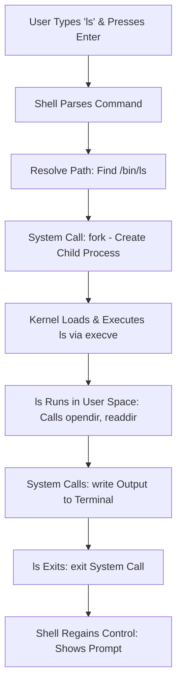
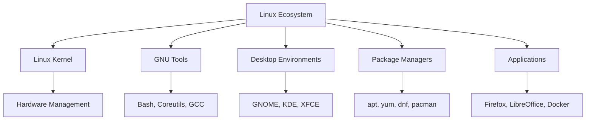

# Day 01: What is Linux? Kernel, Distributions, and Ecosystem

## Learning Objectives
By the end of Day 1, you will:
- Understand what Linux is and its history
- Know the role and function of the Linux kernel
- Identify major Linux distributions and their use cases
- Understand the Linux ecosystem and open-source philosophy
- Recognize why Linux is critical for DevOps, SRE, and Cloud Engineers
- Be familiar with package management concepts and commands

## Why Learn Linux?
Linux is the **backbone of modern technology**. You interact with it every day, often without realizing it. From supercomputers powering scientific research to servers running the internet and smart devices in your home, Linux is everywhere. It is the operating system of choice for developers, system administrators, and cybersecurity professionals. Understanding Linux is an essential skill for anyone pursuing a career in technology.

### Why Linux Matters to You as a DevOps/SRE/Cloud Engineer
Linux is the foundation of modern infrastructure, making it indispensable for DevOps, Site Reliability Engineers (SREs), and Cloud Engineers:
- **DevOps:** Linux powers CI/CD pipelines (e.g., Jenkins, GitLab) and container platforms (e.g., Docker, Kubernetes). Bash scripting automates deployment workflows.
- **SRE:** Linux’s stability and configurability ensure reliable, scalable systems. SREs use Linux for monitoring (e.g., Prometheus), logging, and high-availability setups.
- **Cloud Engineers:** Major cloud platforms (AWS, GCP, Azure) run on Linux instances. Linux proficiency is key for managing VMs, optimizing costs, and configuring cloud services.
- **Automation and Scalability:** Linux’s command-line tools and scripting enable automation, while its lightweight nature supports scaling across thousands of servers.
- **Industry Dominance:** Over 96% of the top 1 million web servers and 100% of the top 500 supercomputers run Linux (as of 2025).

**Quick Fact:** Most cloud-native tools (e.g., Kubernetes, Terraform) are Linux-native, and employers expect Linux proficiency for DevOps/SRE/Cloud roles.

## What is Linux?
- Linux is a free, open-source, Unix-like **operating system kernel** created by Linus Torvalds in 1991.
- It forms the core of many operating systems called "Linux distributions" (distros).
- Linux is used in servers, desktops, embedded systems, supercomputers, IoT devices, and mobile devices (Android).

***Analogy:** Think of the **Linux kernel as a car's engine** 🚗. The engine is the core component that makes the car run and controls all essential functions. But a car isn't just an engine; it needs a body, seats, and a dashboard to be a complete vehicle. That's what a distribution provides.*

### A Brief History of Linux
- **1983:** Richard Stallman starts the **GNU Project** to create a free, Unix-like operating system.
- **1991:** Linus Torvalds releases the first Linux kernel (version 0.01) as a personal project.
- **1993:** Debian, one of the oldest Linux distributions, is founded.
- **1994:** Linux kernel 1.0 is released, marking a stable milestone.
- **2000s:** Linux gains traction in servers, supercomputers, and embedded systems.
- **2010s:** Linux powers Android, cloud platforms (AWS, Azure), and containers (Docker).
- **2025:** Linux runs on over 80% of cloud workloads and is the foundation for AI and IoT ecosystems.

**Fun Fact:** Linus Torvalds still oversees Linux kernel development through the Linux Kernel Mailing List (LKML), ensuring its collaborative spirit.

## Core Components of Linux
Linux is structured in layers, from hardware to user applications. Here's a high-level overview:

```
+----------------------------------------------------+
| User Applications (Vim, Docker, Apache, etc.)     |
+----------------------------------------------------+
| Shell (Bash, Zsh, Fish, etc.)                     |  <-- Part of the OS
+----------------------------------------------------+
| System Libraries (glibc, libc, OpenSSL, etc.)     |  <-- Part of the OS
+----------------------------------------------------+
| System Utilities (ls, grep, systemctl, etc.)      |  <-- Part of the OS
+----------------------------------------------------+
| Linux Kernel (Process, Memory, FS, Network)       |  <-- Core of the OS
+----------------------------------------------------+
| Hardware (CPU, RAM, Disk, Network, Peripherals)   |
+----------------------------------------------------+
```

### (a) Hardware Layer
- The physical components (CPU, RAM, disk, network interfaces, etc.).
- The OS interacts with hardware via device drivers in the kernel.

### (b) Kernel (Core of Linux OS)
- Manages system resources directly:
  - **Process Management:** Schedules processes and handles multitasking.
  - **Memory Management:** Allocates and deallocates RAM efficiently.
  - **Device Drivers:** Interfaces between software and hardware.
  - **File System Management:** Handles data storage and retrieval.
  - **Network Management:** Manages inter-system communication.
- **Kernel Space vs. User Space:** 
  - **Kernel Space:** The privileged mode where the kernel operates, with unrestricted access to hardware and system resources. This allows direct control over CPU, memory, and I/O devices, but it's isolated to prevent crashes from affecting the entire system.
  - **User Space:** The restricted mode for user applications and utilities. Apps here cannot directly access hardware to maintain security and stability—preventing a buggy app from crashing the kernel or compromising the system.
  - **Why the Separation?** It enhances security (e.g., privilege escalation attacks are harder) and reliability (a user app failure doesn't bring down the OS). In DevOps/SRE contexts, this design enables safe containerization (e.g., Docker processes run in user space but leverage kernel features like cgroups for isolation).
  - **System Calls:** The bridge between spaces—user apps request kernel services (e.g., `open()` to read a file, `fork()` to create a process) via system calls. These switch the CPU to kernel mode temporarily, execute the request, and return results. Example: When running `ls`, the shell in user space calls kernel functions to list directory contents.
- **Kernel versions:** Numbered as X.Y.Z (e.g., 5.15.0) where X=major, Y=minor, Z=patch.
- **Monolithic kernel:** Core services run in kernel space for performance, vital for low-latency cloud and container applications.

### (c) Shell (Command Line Interface - CLI)
- A command interpreter that converts user commands into kernel system calls.
- Examples: Bash (default on most distros), Zsh, Fish, Dash, Ksh.
- Essential for DevOps scripting and automation.

#### What Happens When You Run a Command? (Example: `ls`)
When you type a command like `ls` (to list directory contents) and press Enter, the shell orchestrates a multi-step process involving user space and kernel space. Here's a step-by-step breakdown:

1. **User Input:** You type `ls` in the terminal and press Enter. The terminal captures this as input.
2. **Shell Parsing:** The shell (e.g., Bash) reads the command, parses it (checks for arguments, aliases, or built-ins), and determines it's an external program (`/bin/ls`).
3. **Path Resolution:** The shell searches the `$PATH` environment variable for the executable (e.g., finds `/bin/ls`).
4. **Process Creation:** The shell uses a system call (`fork()`) to create a child process for `ls`.
5. **Kernel Execution:** The kernel switches to kernel mode, loads `/bin/ls` into memory (via `execve()` system call), and starts execution in user space.
6. **Command Execution:** `ls` runs in user space, makes system calls (e.g., `opendir()` to open the directory, `readdir()` to read entries) to interact with the file system via the kernel.
7. **Output Generation:** `ls` formats the output (e.g., file names) and writes it to stdout using kernel system calls (`write()`).
8. **Process Termination:** `ls` exits, the child process ends (`exit()` system call), and the shell regains control, displaying the prompt.

This process highlights the shell-kernel handoff, ensuring secure and efficient execution. In DevOps, understanding this enables better debugging of scripts and automation.



### (d) User Applications and System Utilities
- **User Applications:** End-user programs like web browsers, text editors (Vim), DevOps tools (Docker, Ansible), and servers (Apache). Interact with the OS via system calls through the shell or GUI.
- **System Utilities:** Core commands (e.g., ls, grep, systemctl) for system interaction, provided by the GNU Project.
- **File System:** Organizes data in a hierarchical structure; everything is a file.
- **Processes:** Running instances of programs, managed by the kernel.
- **Init System:** Manages system startup and services (systemd, SysVinit).

## Linux vs. Windows
| Feature | Linux | Windows | **Why it matters** |
|-------|-------|---------|---------------------|
| **Source** | Open Source | Proprietary | Open source allows inspection, modification, and distribution, fostering transparency and collaboration critical for DevOps workflows. |
| **File System** | Hierarchical (/) | Drive Letters (C:) | Linux’s hierarchical file system is consistent, ideal for scripting and automation in cloud environments. |
| **Case Sensitivity** | Yes | No | Strict case sensitivity prevents ambiguity, crucial for robust CI/CD scripts. |
| **Users** | Multi-user | Single-user focus | Linux’s multi-user design ensures secure, stable server operations for SREs. |
| **Package Mgmt** | apt, yum, etc. | .exe, .msi | Package managers streamline software and dependency management, essential for cloud automation. |
| **Cost** | Free (no licensing) | Paid licenses | Reduces costs for large-scale deployments in cloud fleets. |
| **Resource Use** | Lightweight | Resource-heavy | Better efficiency for containers and scalable infrastructure. |
| **Security** | Strong privileges, open scrutiny | Frequent vulnerabilities | Minimizes malware risks and enables quick, transparent patches without reboots. |
| **Stability** | High uptime (years without crashes) | Prone to reboots | Ensures 99.99%+ reliability in production environments. |

## Linux Distributions (Distros)
A Linux **distribution** is a complete OS package including the **Linux kernel**, **GNU tools**, a package manager, and applications.

***Analogy:** Different car manufacturers (e.g., Toyota, Ferrari) use a similar engine (the kernel) but build different vehicles for different purposes (e.g., family car vs. race car). Each is a different distribution.*

### Popular Linux Distributions by Category
- **Beginner-friendly:** Ubuntu, Linux Mint, Fedora
- **Enterprise/Server:** RHEL, CentOS Stream, Ubuntu Server
- **Security-focused:** Kali Linux, Parrot Security OS
- **Lightweight/Embedded:** Alpine Linux, Raspberry Pi OS
- **Advanced/Customizable:** Arch Linux, Gentoo

**For DevOps/SRE/Cloud Engineers:**
- **Ubuntu Server** and **CentOS Stream**: Widely used in cloud for stability and support.
- **Alpine Linux**: Popular for lightweight containers due to its minimal footprint.
- **RHEL**: Common in enterprises for long-term support and compliance.

## The Linux Ecosystem
The Linux ecosystem encompasses the tools, technologies, and philosophy that make Linux versatile and powerful, extending beyond the kernel and distros.

- **The GNU Project:** Provides userland tools (e.g., bash, ls, GCC), making distributions usable. Hence, the term **GNU/Linux**.
- **Desktop Environments:** GNOME, KDE, XFCE (less relevant for server-focused roles).
- **Container Technologies:** Docker, Podman, and Kubernetes, critical for DevOps.
- **Cloud Platforms:** AWS, GCP, and Azure rely on Linux instances.

### Package Management in the Ecosystem
Package managers are a cornerstone of the Linux ecosystem, automating software handling across distros.

A **package manager** is a tool that automates installing, updating, configuring, and removing software in Linux, ensuring efficient dependency management—crucial for DevOps automation and reproducible builds.

#### How Does a Package Manager Work?
1. **Repositories (Repos):** Fetches software from official online repositories (e.g., Ubuntu from `archive.ubuntu.com`).
2. **Installing Software:** Downloads the package, resolves dependencies, and configures it automatically.
3. **Updating Software:** A single command updates all packages to the latest versions.
4. **Removing Software:** Cleans up software and unused files without residue.

#### How Package Managers Fetch Software from Repositories
The package manager checks a repository list (e.g., `/etc/apt/sources.list` in Ubuntu), downloads packages/dependencies, and installs them.

**Example Ubuntu Repository Entry:**
```plaintext
Types: deb
URIs: http://ports.ubuntu.com/ubuntu-ports/
Suites: noble noble-updates noble-backports noble-security
Components: main universe restricted multiverse
Signed-By: /usr/share/keyrings/ubuntu-archive-keyring.gpg
```

#### Why Run `apt update` After Installing Ubuntu?
Fresh Ubuntu installs may have outdated packages. Run:
```bash
apt install sudo
sudo apt update  # Updates package lists from repos
sudo apt upgrade -y  # Installs latest versions
```

#### Popular Package Managers in Linux
| Linux Distro   | Package Manager | Command Example          |
|---------------|----------------|--------------------------|
| Ubuntu, Debian | `apt`          | `sudo apt install nginx` |
| Fedora, RHEL, CentOS | `dnf` (or `yum`) | `sudo dnf install nginx` |
| Arch Linux    | `pacman`       | `sudo pacman -S nginx`   |
| OpenSUSE      | `zypper`       | `sudo zypper install nginx` |

#### Essential Package Manager Commands
##### APT (Debian, Ubuntu)
```bash
sudo apt update         # Update package lists
sudo apt upgrade -y     # Upgrade installed packages
sudo apt install nginx  # Install a package
sudo apt remove nginx   # Remove a package
sudo apt autoremove     # Remove unused dependencies
sudo apt search nginx   # Search for a package
```

##### DNF (Fedora, RHEL, CentOS)
```bash
sudo dnf check-update   # Check for updates
sudo dnf update         # Update all packages
sudo dnf install nginx  # Install a package
sudo dnf remove nginx   # Remove a package
```

##### Pacman (Arch Linux)
```bash
sudo pacman -Syu        # Sync and update all packages
sudo pacman -S nginx    # Install a package
sudo pacman -R nginx    # Remove a package
```

##### Zypper (OpenSUSE)
```bash
sudo zypper refresh     # Refresh package list
sudo zypper update      # Update all packages
sudo zypper install nginx  # Install a package
sudo zypper remove nginx   # Remove a package
```

#### Best Practices for Using Package Managers
- Always update before installing: `sudo apt update && sudo apt upgrade -y`
- Clean up: `sudo apt autoremove`
- Enable automatic security updates (Ubuntu): `sudo apt install unattended-upgrades && sudo dpkg-reconfigure unattended-upgrades`

### Visualizing the Linux Ecosystem


### The Open-Source Philosophy
Linux is built on the **open-source philosophy**:
- **Freedom:** Anyone can use, modify, and distribute the code.
- **Collaboration:** Global developers contribute, making Linux robust and innovative.
- **Transparency:** Open code ensures trust and security, vital for enterprise and cloud environments.

The Linux kernel is licensed under the **GNU General Public License (GPL)**, ensuring derivative works remain free. This drives innovation in DevOps tools and cloud infrastructure.

**Discussion Question:** Why do companies like Google, AWS, and Red Hat invest in open-source Linux projects?

### Common Myths About Linux for DevOps/SRE/Cloud Engineers
- **Myth 1: Linux is too complex for cloud work.** Distros like Ubuntu Server and tools like Docker simplify cloud management.
- **Myth 2: Linux isn’t used in production.** Over 80% of cloud workloads and most Kubernetes clusters run on Linux.
- **Myth 3: Linux lacks support for DevOps tools.** Tools like Jenkins, Terraform, and Kubernetes are Linux-native and widely supported.

## Hands-on Exercises & Lab
### Preparing for the Lab
If you don’t have an AWS account:
- **Virtual Machines:** Use VirtualBox/VMware with Ubuntu Server or CentOS Stream ISOs.
- **Free Cloud Alternatives:** Oracle Cloud Free Tier or Google Cloud’s free trial.
- **Local Terminal:** macOS/Linux users can practice commands locally.

**Troubleshooting SSH Issues:**
- **"Permission Denied"**: Run `chmod 400 my-key.pem` and verify username (`ec2-user` for Amazon Linux, `ubuntu` for Ubuntu).
- **Connection Timeout**: Ensure the security group allows SSH (port 22) and check the public IP.

### Part 1: Lab - Launching Two Different Linux Instances
1. **Launch Your First Instance (RHEL-based):**
   - Log in to the **AWS Management Console** and navigate to the EC2 Dashboard.
   - Click **"Launch Instance"** and select the **Amazon Linux 2** AMI.
   - Choose a `t2.micro` instance type and create a new key pair (`.pem` file). **Save this file securely.**
   - Complete the launch process and wait for the instance to be "Running."

2. **Launch Your Second Instance (Debian-based):**
   - Repeat, selecting the **Ubuntu Server** AMI.
   - Use the **same key pair** for simplicity.
   - Complete the launch process and wait for the instance to be "Running."

### Part 2: Connect, Explore, and Identify
1. **Connect to Amazon Linux 2:**
   - Run `chmod 400 my-key.pem`.
   - Connect: `ssh -i "my-key.pem" ec2-user@<amazon_linux_ip_address>`.

2. **Connect to Ubuntu:**
   - Open a new terminal tab/window.
   - Connect: `ssh -i "my-key.pem" ubuntu@<ubuntu_ip_address>`.

### Part 3: Questions for the Lab & Review
1. **Command-Line Basics:**
   - Run `pwd`, `ls`, and `man ls` on either instance.
   - **Questions:** What does `pwd` tell you? Why is `man` useful?

2. **Identify the Distribution:**
   - Run `cat /etc/os-release` on both instances and compare.
   - **Question:** What are the key differences in the output?

3. **Identify Package Managers:**
   - Run `sudo yum update` on Amazon Linux 2 and `sudo apt update` on Ubuntu.
   - **Question:** What happens? Explain the difference in one sentence, referencing the package managers section above.

4. **Distribution vs. Kernel:**
   - **Question:** Explain the difference between the **Linux kernel** and a **Linux distribution** in your own words.

5. **Role of the GNU Project:**
   - **Question:** What is the role of the GNU Project in the Linux ecosystem?

### Part 4: Write and Run a Simple Script
1. On either instance, create `hello.sh`:
   ```bash
   nano hello.sh
   ```
2. Add:
   ```bash
   #!/bin/bash
   echo "Hello, Linux World!"
   echo "My current directory is: $(pwd)"
   echo "My distribution is:"
   cat /etc/os-release | grep PRETTY_NAME
   ```
3. Save (`Ctrl+O`, `Enter`, `Ctrl+X`), make executable (`chmod +x hello.sh`), and run (`./hello.sh`).
4. **Question:** What does each line do? Compare outputs on both instances.

### Part 5: Challenge for DevOps/SRE/Cloud Engineers
- **Task:** Run `uname -r` to check the kernel version on either instance. Compare it to the latest stable version on kernel.org. Why might cloud providers like AWS use older kernels?
- **Hint:** Consider stability, compatibility with cloud tools, and enterprise support.

### Solutions
1. **Command-Line Basics:**
   - `pwd` shows your current location in the file system.
   - `man` provides documentation and examples for commands.

2. **Distribution Identification:**
   - Outputs show different names/IDs (e.g., `NAME="Amazon Linux"`, `ID="amzn"` vs. `NAME="Ubuntu"`, `ID="ubuntu"`), proving distinct distributions.

3. **Package Managers:**
   - `sudo yum update` succeeds on Amazon Linux, fails on Ubuntu.
   - `sudo apt update` succeeds on Ubuntu, fails on Amazon Linux.
   - **Explanation:** Different distributions use different package managers (yum/dnf for RHEL-based, apt for Debian-based).

4. **Distribution vs. Kernel:**
   - The **kernel** manages hardware resources; a **distribution** bundles the kernel with tools, package managers, and software for a complete OS.

5. **GNU Project Role:**
   - Provides userland tools (e.g., bash, coreutils) that complement the kernel to create a functional OS.

## Glossary of Key Terms
- **Kernel:** The core of the OS that manages hardware and system resources.
- **Distribution (Distro):** A complete OS built around the Linux kernel, including tools and applications.
- **Shell:** A command-line interface for interacting with the OS (e.g., bash).
- **Package Manager:** A tool for installing, updating, and managing software (e.g., apt, yum).
- **GNU:** A project providing essential tools that complement the Linux kernel.
- **Open Source:** Software whose source code is freely available for modification and distribution.
- **Repository:** An online storage for software packages, used by package managers.
- **System Libraries:** Shared code (e.g., glibc) that applications use for common functions.
- **System Utilities:** Core commands (e.g., ls, grep) for system interaction.

## Completion Checklist
- [ ] Understand what Linux is and its history
- [ ] Can explain the role of the Linux kernel
- [ ] Know major Linux distributions and their use cases
- [ ] Understand the difference between kernel and distribution
- [ ] Familiar with package management concepts and commands
- [ ] Understand the Linux ecosystem and GNU Project
- [ ] Recognize Linux’s importance for DevOps/SRE/Cloud roles
- [ ] Successfully launched and connected to two Linux instances
- [ ] Ran basic commands and a simple script in the lab
- [ ] Completed the challenge question for deeper insight

## Interview Preparation Questions
Test your knowledge with these common interview questions for DevOps, SRE, and Cloud roles. Aim to answer them confidently, drawing from today's lesson:

1. **What is the Linux kernel, and how does it differ from a Linux distribution?**  
   (Hint: Focus on the kernel's role in hardware management vs. the distro's addition of user tools.)

2. **Explain kernel space vs. user space. Why is this separation important for system security and stability?**  
   (Hint: Discuss system calls and real-world implications like container isolation.)

3. **Name three popular Linux distributions and their typical use cases in a cloud environment.**  
   (Hint: Mention Ubuntu Server for general cloud, Alpine for containers, RHEL for enterprise.)

4. **How do package managers like apt and yum work? Why are they essential for DevOps workflows?**  
   (Hint: Cover repositories, dependency resolution, and automation benefits.)

5. **What is the role of the GNU Project in Linux? Why is the full name often "GNU/Linux"?**  
   (Hint: Explain userland tools like bash and ls.)

6. **Describe the open-source philosophy and how it benefits companies like AWS in their use of Linux.**  
   (Hint: Highlight freedom, collaboration, and transparency.)

7. **In a production SRE role, why might you prefer Linux over Windows for server infrastructure?**  
   (Hint: Reference stability, cost, and scalability from the comparison table.)

8. **How would you check the kernel version on a Linux instance, and why might a cloud provider use an older version?**  
   (Hint: Use `uname -r` and discuss stability/testing.)

## Reflection for DevOps/SRE/Cloud Engineers
- What aspect of Linux (e.g., package managers, scripting) will be most useful in your DevOps/SRE/Cloud work?
- Which distribution (e.g., Ubuntu, Alpine) are you excited to explore for cloud or container use, and why?
