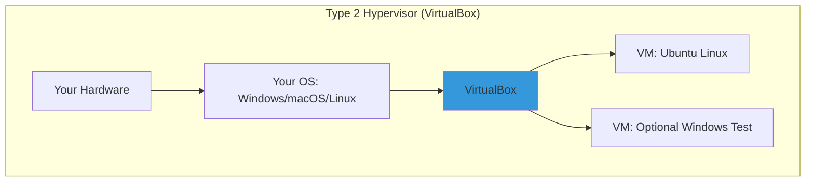

# Day 02: Virtualization & Setting Up Linux (Focus: VirtualBox Hands-On)

## Learning Objectives
By the end of Day 2, you will:
- Understand basic virtualization concepts and hypervisor types
- Install and configure a Linux VM step-by-step in VirtualBox
- Play with your VM: Check network connectivity, take snapshots, and tweak settings
- Get a quick view of the Linux boot process
- Troubleshoot simple VM issues

**Estimated Time:** 1-2 hours

## Why Learn Virtualization?
Virtualization lets you create a "mini-computer" (VM) inside your real one—perfect for safely trying Linux without risking your main setup. Start here, and you're prepped for cloud magic.

### Why It Matters to You as a DevOps/SRE/Cloud Engineer
- **DevOps:** Test scripts in an isolated VM before deploying to real servers.
- **SRE:** Use snapshots to "undo" mistakes, like a time machine for troubleshooting.
- **Cloud Engineers:** Local VMs mimic cloud instances (e.g., AWS EC2) for free practice.
- **Quick Win:** VirtualBox is free and runs on any OS your portable Linux lab.

**Quick Fact:** Most cloud servers are VMs; mastering VirtualBox is like learning the alphabet before writing code.

## What is Virtualization?
Virtualization is the technology that creates **virtual versions of physical resources** (like servers, storage, or networks) on a single piece of hardware. It abstracts the underlying hardware, allowing multiple isolated environments—called **virtual machines (VMs)**—to run simultaneously without interfering.

### Key Components and How It Works
- **Host vs. Guest:** The host is your physical machine (e.g., your laptop). Guests are the VMs running on it (e.g., a Linux server VM).
- **Abstraction Layer:** The hypervisor (more on this below) emulates hardware for guests, allocating slices of CPU, RAM, disk, and network.
- **Types of Virtualization:**
  - **Server Virtualization:** Multiple OSes on one server (e.g., running Ubuntu and Windows VMs).
  - **Desktop Virtualization:** Remote access to VMs (e.g., VDI for secure desktops).
  - **Network/Storage Virtualization:** Pooling resources across devices.

#### Benefits (Why Interviewers Love This)
- **Efficiency:** One server runs 10+ VMs, cutting hardware costs by 70-80%.
- **Isolation:** A crash in one VM doesn't affect others—crucial for SRE reliability.
- **Scalability:** Spin up VMs on-demand (e.g., auto-scaling in AWS).
- **Testing/DevOps:** Reproducible environments; snapshot for "what if" scenarios.
- **Security:** Sandbox malware analysis or multi-tenant clouds.

In interviews, tie this to real-world: "Virtualization enables Kubernetes pods to run isolated on shared nodes, reducing overhead vs. bare metal."

#### Drawbacks (Show Balance)
- Overhead: 5-15% performance hit from emulation.
- Complexity: Managing hypervisors adds a layer (but tools like Kubernetes abstract it).

It's software (hypervisor) that tricks an OS into thinking it's on real hardware, so you can run Linux on Windows (or vice versa).

- **Hypervisors:** The "VM bosses."
  - **Type 1:** Hardware-direct (servers, e.g., VMware ESXi).
  - **Type 2:** On your OS (laptops, e.g., VirtualBox—we're using this!).

***Analogy:** VirtualBox is your **personal hotel manager** —it books rooms (VMs) in your building (hardware) without you lifting a finger.

## Hypervisors: The Engine of Virtualization
A **hypervisor** (or Virtual Machine Monitor, VMM) is the software/firmware that creates, runs, and manages VMs. It's the "brain" allocating resources and enforcing isolation. As of 2025, hypervisors power 95%+ of cloud workloads.

### Type 1 vs. Type 2: The Big Divide
Hypervisors split into two camps based on where they run—interviewers often ask you to compare them.

| Aspect | Type 1 (Bare-Metal/Native) | Type 2 (Hosted) |
|--------|-----------------------------|-----------------|
| **Runs On** | Directly on hardware (no host OS). | On top of a host OS (e.g., Windows). |
| **Performance** | Near-native (1-5% overhead)—ideal for prod servers. | Higher overhead (5-20%)—fine for dev/testing. |
| **Security/Isolation** | Strongest; failures rarely affect hardware. | Depends on host OS; potential single point of failure. |
| **Use Cases** | Enterprise data centers, clouds (e.g., AWS Nitro). | Laptops for learning (e.g., VirtualBox for local labs). |
| **Examples (2025)** | VMware ESXi (vSphere 9.0 with AI optimizations), Microsoft Hyper-V (integrated in Azure), KVM (Linux kernel module, used in OpenStack), Citrix XenServer (now Citrix Hypervisor 8.3). | Oracle VirtualBox (7.0 with Wayland support), VMware Workstation 17 (Pro for teams), Parallels Desktop 20 (Apple Silicon focus). |
| **Pros** | Better scalability, efficiency for high-load (e.g., 1000+ VMs/node). | Easier setup, portable across OSes. |
| **Cons** | Harder to install (dedicated hardware); vendor lock-in risks. | Slower; host OS vulnerabilities expose VMs. |

**Interview Tip:** Say, "For prod SRE at scale, I'd pick Type 1 like KVM for cost/performance; for local dev, Type 2 VirtualBox for quick spins." Draw the table above on a whiteboard to impress.

### Emerging Trends in 2025
Merging Trends in 2025: Unikernels, GPU/ARM Hypervisors, and Open-Source Hybrids
Overview — why these three trends matter together

In 2025 the infrastructure landscape is shaped by two big forces:

Tighter specialization: workloads (microservices, edge functions, serverless) push OS/VM/runtime designs toward smaller, faster, more secure execution environments (unikernels, microVMs).

Heterogeneous compute & AI demand: AI/ML workloads require acceleration (GPUs, DPUs, specialized AI chips) and often run on ARM-based platforms at cloud scale, forcing hypervisor vendors and open-source stacks to add richer GPU/ARM support and GPU-sharing models.

Taken together, these forces drive more variety in “what a VM looks like” — from tiny unikernel images or Firecracker microVMs used for serverless, to full VMs with vGPUs orchestrated by platforms such as vSphere/VMware and KVM-based clouds. The rest of this note examines each trend, evidence, pros/cons, and how they interoperate.

**Unikernels** : tiny, purpose-built execution units (what & why)

What they are.
A unikernel is a single-purpose binary that combines application code and only the kernel/library components it needs, producing very small, specialized VMs that typically boot fast and have a small attack surface. MirageOS is one prominent project (OCaml-based) that builds unikernels for network services. 
mirage.io
+1

Why they’re attractive in 2025.

Footprint & boot time. Extremely compact images and near-instant start make them well suited for ephemeral microservices, cold-start sensitive serverless functions, and edge devices. (Research and surveys in 2025 continue to highlight the efficiency gains.) 
Fixstars Corporation Tech Blog
+1

Security. Eliminating unnecessary subsystems reduces attack surface (no shell, limited syscalls). MirageOS and contemporary surveys emphasize type-safety and smaller codebases as security benefits. 
Bobkonf

Deterministic resource usage. Because there’s no multipurpose OS with background tasks, resource consumption is easier to bound — useful at the edge and in real-time workloads. 
Fixstars Corporation Tech Blog

Where unikernels fit best

Highly specific networking services (DNS resolvers, small proxies, authentication validators).

Edge and constrained environments where minimal memory/boot latency matter.

Companies that can invest in tooling to build/test unikernels (language support and lib portability matter).

Limitations / adoption barriers

Ecosystem and tooling maturity. Containers and Linux have a huge ecosystem (packaging, observability, debugging). Unikernels still suffer tooling, debugging, and library porting gaps. (See state-of-play surveys.) 
Fixstars Corporation Tech Blog
+1

Compatibility & developer velocity. Rewriting or adapting apps to unikernel-friendly runtimes is non-trivial.

Operational complexity. Image build chains, debugging, and observability require reworking CI/CD and ops practices.

Practical hybrid approach (common in 2025)
Many organizations adopt unikernels selectively: for performance/security critical microservices at the edge while keeping mainstream app stacks in containers. The research/industry trend is toward selective unikernel adoption rather than full replacement. 
Fixstars Corporation Tech Blog

