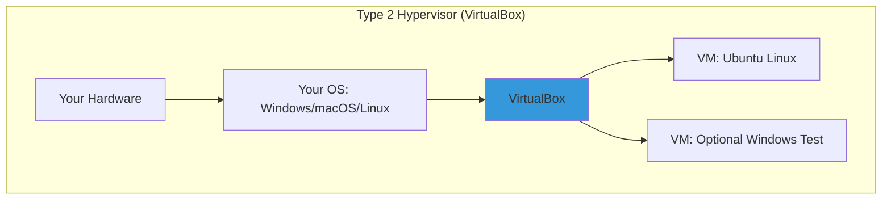

# Day 02: Virtualization & Setting Up Linux (Focus: VirtualBox Hands-On)

## Learning Objectives
By the end of Day 2, you will:
- Understand basic virtualization concepts and hypervisor types
- Install and configure a Linux VM step-by-step in VirtualBox
- Play with your VM: Check network connectivity, take snapshots, and tweak settings
- Get a quick view of the Linux boot process
- Troubleshoot simple VM issues

**Estimated Time:** 1-2 hours

## Why Learn Virtualization?
Virtualization lets you create a "mini-computer" (VM) inside your real one—perfect for safely trying Linux without risking your main setup. Start here, and you're prepped for cloud magic.

### Why It Matters to You as a DevOps/SRE/Cloud Engineer
- **DevOps:** Test scripts in an isolated VM before deploying to real servers.
- **SRE:** Use snapshots to "undo" mistakes, like a time machine for troubleshooting.
- **Cloud Engineers:** Local VMs mimic cloud instances (e.g., AWS EC2) for free practice.
- **Quick Win:** VirtualBox is free and runs on any OS your portable Linux lab.

**Quick Fact:** Most cloud servers are VMs; mastering VirtualBox is like learning the alphabet before writing code.

## What is Virtualization?
Virtualization is the technology that creates **virtual versions of physical resources** (like servers, storage, or networks) on a single piece of hardware. It abstracts the underlying hardware, allowing multiple isolated environments—called **virtual machines (VMs)**—to run simultaneously without interfering.

### Key Components and How It Works
- **Host vs. Guest:** The host is your physical machine (e.g., your laptop). Guests are the VMs running on it (e.g., a Linux server VM).
- **Abstraction Layer:** The hypervisor (more on this below) emulates hardware for guests, allocating slices of CPU, RAM, disk, and network.
- **Types of Virtualization:**
  - **Server Virtualization:** Multiple OSes on one server (e.g., running Ubuntu and Windows VMs).
  - **Desktop Virtualization:** Remote access to VMs (e.g., VDI for secure desktops).
  - **Network/Storage Virtualization:** Pooling resources across devices.

#### Benefits (Why Interviewers Love This)
- **Efficiency:** One server runs 10+ VMs, cutting hardware costs by 70-80%.
- **Isolation:** A crash in one VM doesn't affect others—crucial for SRE reliability.
- **Scalability:** Spin up VMs on-demand (e.g., auto-scaling in AWS).
- **Testing/DevOps:** Reproducible environments; snapshot for "what if" scenarios.
- **Security:** Sandbox malware analysis or multi-tenant clouds.

In interviews, tie this to real-world: "Virtualization enables Kubernetes pods to run isolated on shared nodes, reducing overhead vs. bare metal."

#### Drawbacks (Show Balance)
- Overhead: 5-15% performance hit from emulation.
- Complexity: Managing hypervisors adds a layer (but tools like Kubernetes abstract it).

It's software (hypervisor) that tricks an OS into thinking it's on real hardware, so you can run Linux on Windows (or vice versa).

- **Hypervisors:** The "VM bosses."
  - **Type 1:** Hardware-direct (servers, e.g., VMware ESXi).
  - **Type 2:** On your OS (laptops, e.g., VirtualBox—we're using this!).

***Analogy:** VirtualBox is your **personal hotel manager** —it books rooms (VMs) in your building (hardware) without you lifting a finger.

## Hypervisors: The Engine of Virtualization
A **hypervisor** (or Virtual Machine Monitor, VMM) is the software/firmware that creates, runs, and manages VMs. It's the "brain" allocating resources and enforcing isolation. As of 2025, hypervisors power 95%+ of cloud workloads.

### Type 1 vs. Type 2: The Big Divide
Hypervisors split into two camps based on where they run—interviewers often ask you to compare them.

| Aspect | Type 1 (Bare-Metal/Native) | Type 2 (Hosted) |
|--------|-----------------------------|-----------------|
| **Runs On** | Directly on hardware (no host OS). | On top of a host OS (e.g., Windows). |
| **Performance** | Near-native (1-5% overhead)—ideal for prod servers. | Higher overhead (5-20%)—fine for dev/testing. |
| **Security/Isolation** | Strongest; failures rarely affect hardware. | Depends on host OS; potential single point of failure. |
| **Use Cases** | Enterprise data centers, clouds (e.g., AWS Nitro). | Laptops for learning (e.g., VirtualBox for local labs). |
| **Examples (2025)** | VMware ESXi (vSphere 9.0 with AI optimizations), Microsoft Hyper-V (integrated in Azure), KVM (Linux kernel module, used in OpenStack), Citrix XenServer (now Citrix Hypervisor 8.3). | Oracle VirtualBox (7.0 with Wayland support), VMware Workstation 17 (Pro for teams), Parallels Desktop 20 (Apple Silicon focus). |
| **Pros** | Better scalability, efficiency for high-load (e.g., 1000+ VMs/node). | Easier setup, portable across OSes. |
| **Cons** | Harder to install (dedicated hardware); vendor lock-in risks. | Slower; host OS vulnerabilities expose VMs. |

**Interview Tip:** Say, "For prod SRE at scale, I'd pick Type 1 like KVM for cost/performance; for local dev, Type 2 VirtualBox for quick spins." Draw the table above on a whiteboard to impress.

### Emerging Trends in 2025
Merging Trends in 2025: Unikernels, GPU/ARM Hypervisors, and Open-Source Hybrids
Overview — why these three trends matter together

In 2025 the infrastructure landscape is shaped by two big forces:

Tighter specialization: workloads (microservices, edge functions, serverless) push OS/VM/runtime designs toward smaller, faster, more secure execution environments (unikernels, microVMs).

Heterogeneous compute & AI demand: AI/ML workloads require acceleration (GPUs, DPUs, specialized AI chips) and often run on ARM-based platforms at cloud scale, forcing hypervisor vendors and open-source stacks to add richer GPU/ARM support and GPU-sharing models.

Taken together, these forces drive more variety in “what a VM looks like” — from tiny unikernel images or Firecracker microVMs used for serverless, to full VMs with vGPUs orchestrated by platforms such as vSphere/VMware and KVM-based clouds. The rest of this note examines each trend, evidence, pros/cons, and how they interoperate.

**Unikernels** : tiny, purpose-built execution units (what & why)

What they are.
A unikernel is a single-purpose binary that combines application code and only the kernel/library components it needs, producing very small, specialized VMs that typically boot fast and have a small attack surface. MirageOS is one prominent project (OCaml-based) that builds unikernels for network services. 
mirage.io
+1

Why they’re attractive in 2025.

Footprint & boot time. Extremely compact images and near-instant start make them well suited for ephemeral microservices, cold-start sensitive serverless functions, and edge devices. (Research and surveys in 2025 continue to highlight the efficiency gains.) 
Fixstars Corporation Tech Blog
+1

Security. Eliminating unnecessary subsystems reduces attack surface (no shell, limited syscalls). MirageOS and contemporary surveys emphasize type-safety and smaller codebases as security benefits. 
Bobkonf

Deterministic resource usage. Because there’s no multipurpose OS with background tasks, resource consumption is easier to bound — useful at the edge and in real-time workloads. 
Fixstars Corporation Tech Blog

Where unikernels fit best

Highly specific networking services (DNS resolvers, small proxies, authentication validators).

Edge and constrained environments where minimal memory/boot latency matter.

Companies that can invest in tooling to build/test unikernels (language support and lib portability matter).

Limitations / adoption barriers

Ecosystem and tooling maturity. Containers and Linux have a huge ecosystem (packaging, observability, debugging). Unikernels still suffer tooling, debugging, and library porting gaps. (See state-of-play surveys.) 
Fixstars Corporation Tech Blog
+1

Compatibility & developer velocity. Rewriting or adapting apps to unikernel-friendly runtimes is non-trivial.

Operational complexity. Image build chains, debugging, and observability require reworking CI/CD and ops practices.

Practical hybrid approach (common in 2025)
Many organizations adopt unikernels selectively: for performance/security critical microservices at the edge while keeping mainstream app stacks in containers. The research/industry trend is toward selective unikernel adoption rather than full replacement. 
Fixstars Corporation Tech Blog

2) **GPU & ARM support in hypervisors: optimizing for AI workloads**

Context.
AI workloads are driving hypervisor evolution. Two important trends are: (a) better GPU integration (vGPU, passthrough, resource reservation, and orchestration for multi-tenant AI) and (b) wider ARM adoption (servers and cloud instances using Arm/Graviton families). Vendors and open stacks are adapting to both. 
NVIDIA Docs
+1

What vendors are doing (examples & capabilities):

vGPU & GPU orchestration in enterprise hypervisors. VMware and related stacks now surface features for reserving GPU slots, vGPU support for compute workloads, and deeper integrations in AI-focused releases. VMware’s Private AI/Foundation releases and vSphere updates include NVIDIA vGPU and AI-oriented features. These help guarantee GPU availability to latency-sensitive models and enable multi-tenant sharing of GPU resources. 
Broadcom TechDocs
+1

GPU virtualization models. There are several modes: full PCIe passthrough (dedicate entire GPU to a VM), vendor vGPU (time/memory sliced virtualization), and emerging disaggregated orchestration at rack scale. NVIDIA’s vGPU and NVIDIA AI Enterprise docs remain a key reference for deploying GPUs in virtualized environments. 
NVIDIA Docs
+1

ARM & heterogenous servers. Public clouds have accelerated ARM (Graviton) adoption; on-prem hypervisors and experimental arm ports (e.g., ESXi-ARM flings) demonstrate momentum for ARM in private/edge deployments. KVM-based clouds (and cloud-native orchestration) increasingly consider ARM-first instance types and tooling. 
ARM
+1

Why this matters for AI

Lower cost / better power efficiency. ARM-based servers (Graviton) often offer better perf/watt for certain workloads; heterogeneous setups let operators place parts of workloads on different accelerator types. 
Medium

Operational flexibility. vGPU and GPU orchestration let many AI teams share expensive GPUs, improving utilization while preserving isolation. VMware and other hypervisor vendors are expanding feature sets to meet enterprise AI needs. 
Broadcom TechDocs
+1

Caveats and practical concerns

Performance parity. Some vGPU or slicing modes may not match bare-metal performance (driver and scheduler behavior matters). Full passthrough still gives the best raw performance for large model training. Documentation and compatibility matrices (NVIDIA, VMware) are essential for production deployment choices. 
NVIDIA Docs
+1

Complex orchestration. Managing mixed fleets (x86, ARM, GPUs) increases scheduling complexity and tooling needs (node labelling, instance types, affinity rules).

3) **Open-source rise & container–hypervisor hybrids (KVM, Firecracker, Kata, gVisor)**

A short state of the landscape.
By 2025 KVM remains the dominant open-source hypervisor under the hood of many public clouds and virtualization platforms; large cloud providers and open-source projects continue to invest in KVM-based tooling and platforms (OpenShift Virtualization being one notable enterprise-level example of VM+container integration). 
Spectro Cloud
+1

Why KVM + open-source is gaining ground

Cloud-native integration. KVM integrates well into Linux-based cloud stacks and container ecosystems; projects such as OpenShift Virtualization bring VMs into Kubernetes control planes so teams can manage VMs and containers from a single platform. Adoption metrics for OpenShift Virtualization suggest strong growth. 
Red Hat

Community & ecosystem. KVM has broad vendor, distro, and cloud support; that makes it easier for cloud builders to standardize on open virtualization layers. 
Spectro Cloud

Container–hypervisor hybrids: what they are

MicroVMs & micro-hypervisors (Firecracker): tiny VM-like isolation units designed for serverless / fast-start functions. Firecracker, initially developed by AWS for Lambda and Fargate, is the archetype: microVMs provide stronger isolation than containers while keeping low overhead and fast startup times. 
firecracker-microvm.github.io
+1

Kata Containers / gVisor: offer different trade-offs: Kata uses lightweight VMs to run containers (stronger isolation, near-VM semantics); gVisor implements a user-space kernel for container isolation focusing on compatibility with existing container workflows. Comparison pieces in 2025 discuss tradeoffs between Firecracker, Kata, and gVisor for security, speed, and compatibility. 
Onidel Cloud
+1

Why container-hypervisor hybrids are popular now

Security & multitenancy. MicroVMs and VM-backed containers give stronger isolation for untrusted workloads (multi-tenant serverless, FaaS, managed runtimes).

Performance trade-offs. Firecracker’s microVM design provides acceptable cold-start performance with better isolation than plain containers, making it attractive for serverless platforms and edge compute that require multi-tenant security. 
firecracker-microvm.github.io
+1

How the three trends interact (practical convergence)

Unikernels + microVMs: unikernels can be packaged as minimal VM images (or microVMs) to get both the tiny binary/boot benefits of unikernels and the isolation/management of microVMs like Firecracker. This is an attractive stack for secure edge functions: unikernel binary + microVM runtime. (Research and community experiments show this as a logical combination.) 
Fixstars Corporation Tech Blog
+1

GPU/ARM in a mixed estate: organizations will run some workloads on KVM or VMware with vGPU support for heavy AI training, while using Firecracker or unikernels for low-latency inference or edge functions. Orchestration layers (Kubernetes/OpenShift) will increasingly need to reason about device topology (GPUs, DPUs, ARM vs x86) when scheduling. 
NVIDIA Docs
+1

Open-source ecosystems enable experimentation: KVM + Firecracker + Kata ecosystems allow developers to pick the isolation/performance profile they need, and OpenShift-like platforms make it possible to manage VMs and containers in a unified control plane. 
Spectro Cloud
+1

Real-world implications & adoption advice (for architects/engineers)

When to use unikernels

Use them for small, critical network/edge functions where boot time, small memory, and a minimized attack surface are decisive.

Prototype with MirageOS (or other unikernel toolchains) for targeted services, not as a wholesale container replacement. 
mirage.io
+1

When to pick Firecracker / microVMs / Kata

Choose Firecracker for serverless or multi-tenant function hosting where isolation matters but you still need high density and fast startup. Firecracker is battle-tested in serverless contexts (AWS). 
firecracker-microvm.github.io
+1

Consider Kata when you need full VM-level isolation for container workloads with compatibility for standard container tooling (but with VM security characteristics). 
Onidel Cloud

When you need full hypervisor features (vSphere / KVM + vGPU)

For heavy, GPU-bound AI training or production inference that requires predictable performance or vendor-certified stacks (NVIDIA vGPU), a full hypervisor with vGPU and enterprise support may be the right choice. Check vendor compatibility matrices and vGPU docs. 
NVIDIA Docs
+1

Operational note

Mixed-fleet scheduling (ARM + x86 + GPUs) is complex: plan for node labelling, affinity rules, multi-architecture CI pipelines, and image/build pipelines for each architecture. Public cloud providers already offer ARM-first instances; on-prem experimentation (ESXi-Arm flings, KVM on ARM hardware) demonstrates feasibility, but production readiness varies by vendor. 
WilliamLam.com
+1

Challenges, risks & gaps to watch

Tooling & debugging for unikernels. Expect continued friction: fewer off-the-shelf libraries, unique debugging traces, and bespoke CI. Research and community progress is closing gaps but not eliminating them yet. 
Fixstars Corporation Tech Blog

GPU virtualization complexity. vGPU behavior, drivers, and performance differences can surprise you: always validate with workload-representative benchmarks and consult vendor compatibility matrices. 
NVIDIA Docs

Portability & fragmentation. More runtime types (unikernel, microVM, VM, container) mean more build/test permutations and potential fragmentation unless platforms provide strong abstractions. 
Medium

# Quick Peek: The Linux Boot Process
When your VM starts, it "wakes up" in steps—watch it to feel the flow.

The Linux boot is a choreographed sequence turning hardware into a usable OS. It's interview gold—expect "Walk me through it" or "Debug a hang at stage X." As of 2025, systemd dominates (95% distros), but the core flow is timeless.

### Detailed Step-by-Step

1. **Power-On Self-Test (POST) & Firmware (BIOS/UEFI):** 
   - Hardware powers up; firmware (BIOS legacy or UEFI modern) tests components (CPU, RAM, disks). In VMs, hypervisor emulates this (~1-2s).
   - Locates boot device (e.g., /dev/sda in VM disk). UEFI uses GPT partitions; BIOS MBR.

2. **Bootloader Stage (GRUB2):**
   - GRUB (GNU GRand Unified Bootloader) loads from boot sector. Scans /boot/grub/grub.cfg for kernels (vmlinuz-*).
   - Shows menu (hold Shift); user selects entry. Passes params (e.g., root=/dev/sda1) to kernel.
   - Chains to other OSes if dual-boot. Time: <5s.

3. **Kernel Initialization:**
   - Kernel (bzImage) decompresses into RAM. Mounts initramfs (compressed FS with early drivers).
   - Probes hardware (via modules like virtio for VMs), sets up memory (paging), mounts real root FS (/).
   - Starts PID 1 (init). Logs to dmesg. Time: 5-20s.

4. **Init System (systemd):**
   - systemd reads /etc/fstab for mounts; parses units in /lib/systemd/system.
   - Reaches default target (multi-user.target for servers; graphical.target for desktops).
   - Starts services parallel (e.g., NetworkManager, sshd). Time: 10-60s.

5. **User Space & Login:**
   - getty spawns on tty/SSH; PAM authenticates user.
   - Shell (bash) loads ~/.profile; prompt appears. GUI: display manager (gdm) starts X11/Wayland.

**Total Time:** 30-90s on SSD; slower on HDD. In 2025, dracut optimizes initramfs for faster embedded boots.

**VM Nuances:** Hypervisor provides virtual BIOS (SeaBIOS) or UEFI (OVMF); boot faster sans real hardware checks.

**Debug Tips:** `journalctl -b` (systemd logs), `dmesg` (kernel), `systemd-analyze blame` (service timings)—interview gold for "slow boot?" scenarios.

Run `systemd-analyze` after boot to see timings—fun metric!