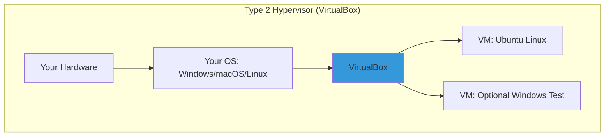

# Day 02: Virtualization & Setting Up Linux (Focus: VirtualBox Hands-On)

## Learning Objectives
By the end of Day 2, you will:
- Understand basic virtualization concepts and hypervisor types
- Install and configure a Linux VM step-by-step in VirtualBox
- Play with your VM: Check network connectivity, take snapshots, and tweak settings
- Get a quick view of the Linux boot process
- Troubleshoot simple VM issues

**Estimated Time:** 1-2 hours

## Why Learn Virtualization?
Virtualization lets you create a "mini-computer" (VM) inside your real one—perfect for safely trying Linux without risking your main setup. Start here, and you're prepped for cloud magic.

### Why It Matters to You as a DevOps/SRE/Cloud Engineer
- **DevOps:** Test scripts in an isolated VM before deploying to real servers.
- **SRE:** Use snapshots to "undo" mistakes, like a time machine for troubleshooting.
- **Cloud Engineers:** Local VMs mimic cloud instances (e.g., AWS EC2) for free practice.
- **Quick Win:** VirtualBox is free and runs on any OS your portable Linux lab.

**Quick Fact:** Most cloud servers are VMs; mastering VirtualBox is like learning the alphabet before writing code.

## What is Virtualization?
Virtualization is the technology that creates **virtual versions of physical resources** (like servers, storage, or networks) on a single piece of hardware. It abstracts the underlying hardware, allowing multiple isolated environments—called **virtual machines (VMs)**—to run simultaneously without interfering.

### Key Components and How It Works
- **Host vs. Guest:** The host is your physical machine (e.g., your laptop). Guests are the VMs running on it (e.g., a Linux server VM).
- **Abstraction Layer:** The hypervisor (more on this below) emulates hardware for guests, allocating slices of CPU, RAM, disk, and network.
- **Types of Virtualization:**
  - **Server Virtualization:** Multiple OSes on one server (e.g., running Ubuntu and Windows VMs).
  - **Desktop Virtualization:** Remote access to VMs (e.g., VDI for secure desktops).
  - **Network/Storage Virtualization:** Pooling resources across devices.

#### Benefits (Why Interviewers Love This)
- **Efficiency:** One server runs 10+ VMs, cutting hardware costs by 70-80%.
- **Isolation:** A crash in one VM doesn't affect others—crucial for SRE reliability.
- **Scalability:** Spin up VMs on-demand (e.g., auto-scaling in AWS).
- **Testing/DevOps:** Reproducible environments; snapshot for "what if" scenarios.
- **Security:** Sandbox malware analysis or multi-tenant clouds.

In interviews, tie this to real-world: "Virtualization enables Kubernetes pods to run isolated on shared nodes, reducing overhead vs. bare metal."

#### Drawbacks (Show Balance)
- Overhead: 5-15% performance hit from emulation.
- Complexity: Managing hypervisors adds a layer (but tools like Kubernetes abstract it).

It's software (hypervisor) that tricks an OS into thinking it's on real hardware, so you can run Linux on Windows (or vice versa).

- **Hypervisors:** The "VM bosses."
  - **Type 1:** Hardware-direct (servers, e.g., VMware ESXi).
  - **Type 2:** On your OS (laptops, e.g., VirtualBox—we're using this!).

***Analogy:** VirtualBox is your **personal hotel manager** —it books rooms (VMs) in your building (hardware) without you lifting a finger.

## Hypervisors: The Engine of Virtualization
A **hypervisor** (or Virtual Machine Monitor, VMM) is the software/firmware that creates, runs, and manages VMs. It's the "brain" allocating resources and enforcing isolation. As of 2025, hypervisors power 95%+ of cloud workloads.

